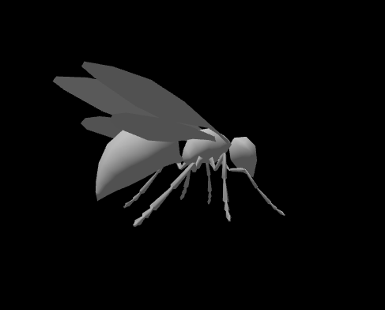
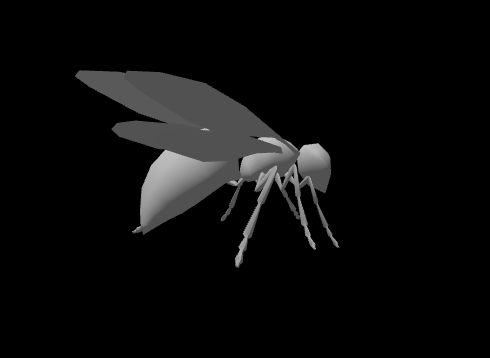

# Basic OpenGL Character Animation Workflow

features:
- Skeleton and movable joints/bones
- Smooth skinning algorithm that deforms mesh over the bones
- Support for keyframe animations

# Walking Wasp

